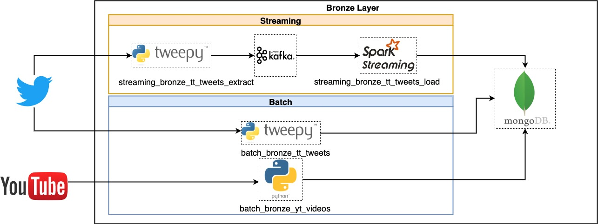
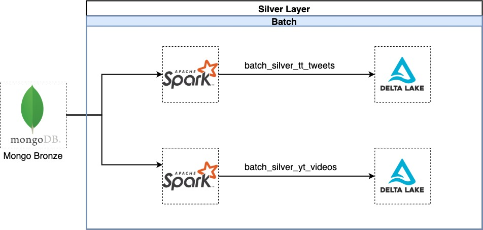

# Data Master Santander - Eng. de Dados

Este case foi desenvolvido visando demonstrar alguns cenários de ingestão e tratamento de dados comuns na rotina de um engenheiro de dados.

Foram desenvolvidos 6 motores, divididos em 2 fontes de dados (Twitter e Youtube) e em duas camadas de organização do Data Lake (Bronze e Silver).

Segue desenho de solução macro contendo todos os componentes:





A infraestrutura foi montada utilizando containers no Docker com docker-compose. 
Segue desenho de infraestrutura:


## Stack utilizada

* Docker - Infraestrutura
* PySpark e Spark Streaming - Processamento batch e streaming
* [Tweepy](https://www.tweepy.org/) - Integração com Twitter API v2
* Python 3 - Ingestão batch
* Kafka + Zookeeper - Streaming de eventos
* MongoDB - Repositório de dados raw na camada Bronze
* [Delta Lake](https://delta.io/) - Repositório de dados tratados na camada Silver
* [Mongo-Express](https://github.com/mongo-express/mongo-express) - Interface web de gerenciamento do MongoDB
* [Kafka-ui](https://github.com/provectus/kafka-ui) - Interface web de gerenciamento do Kafka

## Motores de dados

### Camada Bronze Batch

#### batch_bronze_tt_tweets:

Este processo realiza extração dos Tweets utilizando a [API v2 e o endpoint de busca rescente](https://developer.twitter.com/en/docs/twitter-api/tweets/search/api-reference/get-tweets-search-recent).\
O motor realiza a busca do termo "santander" onde o tweet não seja uma reply nem um retweet.
O processo foi desenvolvido utilizando Python + Tweepy, e envia os dados extraídos para o MongoDB na estrutura:
```shell
    {'_id', 'json'{}, 'dat_ref_carga_batch'}

```
Onde o campo 'json' consiste no retorno da API para a query:
```
(client.search_recent_tweets,' "santander" -is:retweet -is:reply', 
                            tweet_fields=["id","author_id","text","created_at","geo","lang","public_metrics","source"],
                            user_fields = ['name','username','location','verified'],
                            expansions = ['geo.place_id','author_id'],
                            place_fields = ['country','country_code'],
                            max_results=50,
                            limit=limit
                            )
```
A quantidade de tweets retornados é parametrizada e deve ser informado em momento de execução do programa. Exemplo:

```shell
docker exec -ti jupyter-pyspark sh /app/twitter/bronze/batch/start_batch_bronze_tt_tweets.sh 150
```

Caso não informado o motor realiza a extração de 100 mensagens.

#### batch_bronze_yt_videos:

Este motor extrai as informações de todos os videos do canal "Santander Brasil" no YouTube, no formato Json e insere no MongoDB.
Foi utilizada a [google-api-python-client](https://developers.google.com/youtube/v3) para integração com a API.

Esta extração é sempre full e não parametrizavel. Sáo utilzados os endpoints de [channels](https://developers.google.com/youtube/v3/docs/channels/list) e [videos](https://developers.google.com/youtube/v3/docs/videos/list) para compor o Json final.

#### Observação:

Ambos os processos realizam carga no MongoDB no método de "upsert", gravando a data de carga na coluna de controle "dat_ref_carga_batch".
Ao fazer update e insert conseguimos ter métricas como retweet, likes e reply (no caso do Twitter) e likes, comments e views (no YouTube) atualizados a cada carga.
Para que isso seja possível, o :_id" do documento em cada tabela foi populado com o id único de cada retorno de API. São eles:\

- Twitter: ID do tweet, único e inalterável;
- YouTube: videoID, também único e impossível de alterar.

### Camada Bronze Fast

#### streaming_bronze_tt_tweets_extract:

Foi desenvolvido um script Python que também utiliza o Tweepy e Twitter API v2 para consulta, mas desta vez envia os dados para um tópico Kafka. \
Foi utilizada a class [StreamingClient](https://docs.tweepy.org/en/latest/streamingclient.html#tweepy.StreamingClient) para o recebimento contínuo das mensagens. Este processo utiliza exatamente a mesma query de consulta ao endpoit. \
O dado é enviado ao tópico Kafka utilizando a biblioteca [kafka-python](https://kafka-python.readthedocs.io/en/master/).


#### streaming_bronze_tt_tweets_load:
Usando o Spark Structured Streaming, o motor realiza a leitura do tópico citado anteriormente, aplica um tratamento de saneamento no Json e insere no MongoDB. \
Um ponto importante é que a carga é realizada na mesma tabela (Collection) do MongoDB onde o processo Batch insere. Com isso, temos uma Arquitetura Lambda de ingestão dos dados. \
Devido a isso, foram criadas duas colunas de controle na tabela. São elas:
 - dat_ref_carga_batch
 - dat_ref_carga_fast

 Essas colunas foram criadas visando rastreabilidade das atualizações, bem como o controle das cargas.

 ### Camada Silver Batch
 
 #### batch_silver_tt_tweets:
 
Processo de carga dos dados de tweets extraídos anteriormente no formato tabular, refiado com filtros de coluna, levando apenas o pertinente para a camada Silver. \
Neste motor, foi utilizado o PySpark para extração do MongoDB, transformação da estrutura dos dados para um formato tabular e carga num diretório no formato Delta (.parquet). \
O Delta Lake foi escolhido como repositório de dados neste projeto principalmente por: \ 

 1- Possibilidade de realizar update das informações (merge) e; \
 2- Possibilitar consultas analíticas em versões anteriores do dado ([Time Travel](https://databricks.com/blog/2019/02/04/introducing-delta-time-travel-for-large-scale-data-lakes.html))

Devido a volumetria imaginada para este fluxo, o dado final foi particionado pela data (YYYY-MM-DD) com base na data de criação do tweet.
 
 #### batch_silver_yt_videos:

 Processo muito semelhante ao anterior, onde o PySpark realiza a extração das informações de vídeos do MongoDB, estrutura os dados e grava no formato Delta.
 Por ter baixa volumetria, este processo sempre realiza extração e carga full.

## Execução dos Motores

batch_bronze_tt_tweets

```bash
docker exec -ti jupyter-pyspark sh /app/twitter/bronze/batch/start_batch_bronze_tt_tweets.sh 150
```

streaming_bronze_tt_tweets_extract

```bash
docker exec -ti jupyter-pyspark sh /app/twitter/bronze/streaming/extract/start_streaming_bronze_tt_tweets_extract.sh
```

streaming_bronze_tt_tweets_load

```bash
docker exec -ti jupyter-pyspark sh /app/twitter/bronze/streaming/load/start_streaming_bronze_tt_tweets_load.sh
```

batch_silver_tt_tweets

```bash
docker exec -ti jupyter-pyspark /bin/bash /app/twitter/silver/batch/start_batch_silver_tt_tweets.sh
```

batch_bronze_yt_videos

```bash
docker exec -ti jupyter-pyspark /bin/bash /app/youtube/bronze/batch/start_batch_bronze_yt_videos.sh
```


batch_silver_yt_videos

```bash
docker exec -ti jupyter-pyspark /bin/bash /app/youtube/silver/batch/start_batch_silver_yt_videos.sh
```

